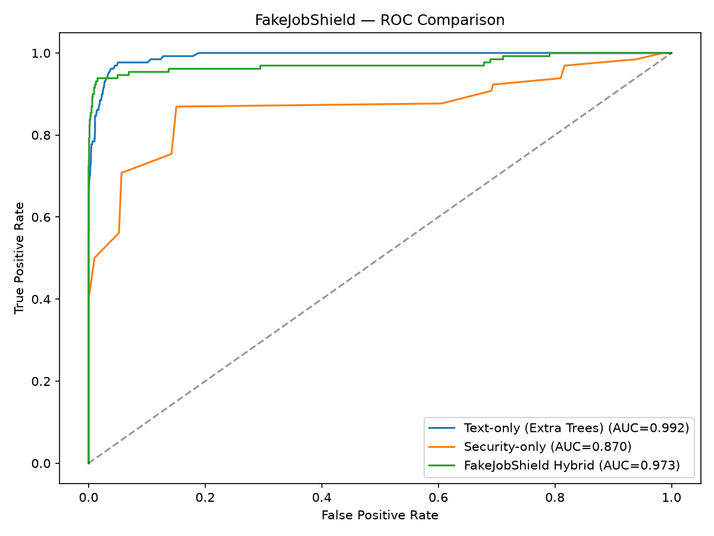
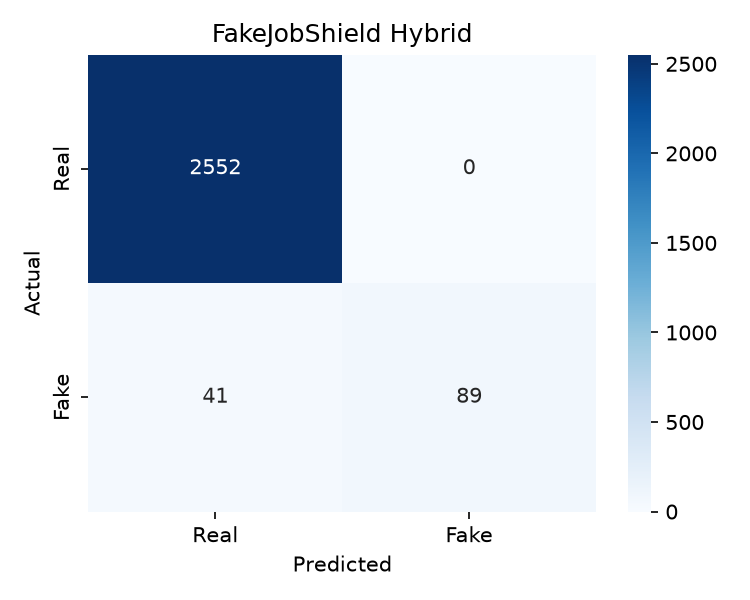
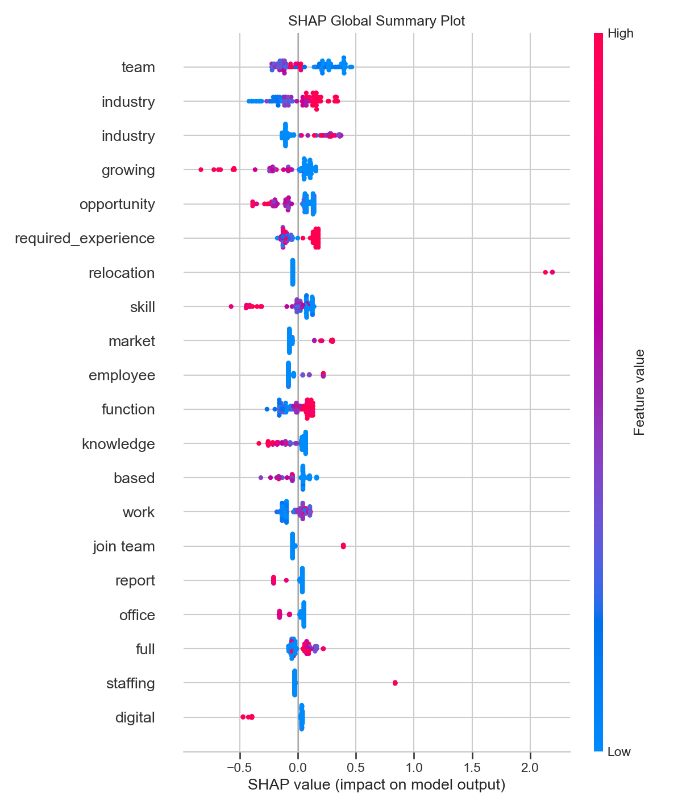
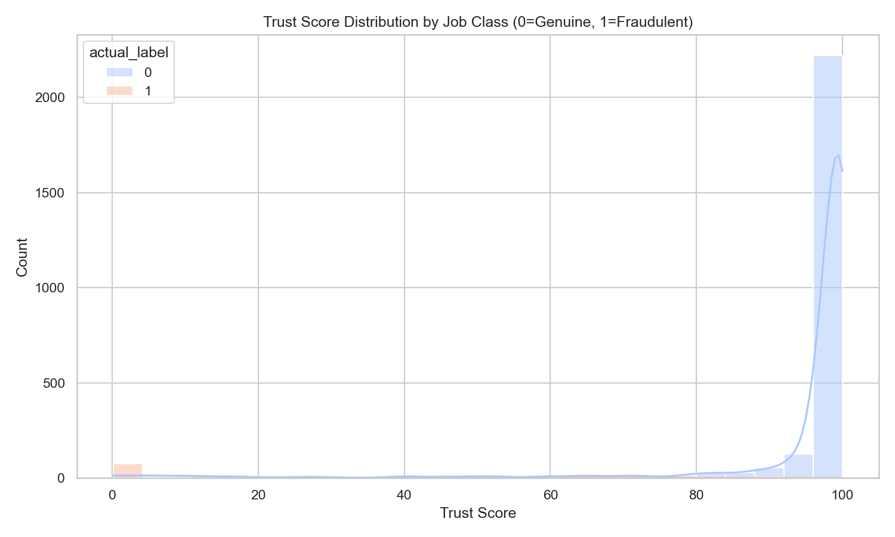

# FakeJobShield: An Explainable Hybrid AI and Cybersecurity Framework for Fraudulent Job Advertisement Detection

**Authors:** Rudra Joshi, et al.  
**Affiliation:** Department of Computer Science & Engineering  
**Contact Email:** rudravjoshi007@gmail.com, 23dce050@charusat.edu.in  

---

## Abstract

Online recruitment portals have significantly accelerated hiring processes but have also opened new vectors for employment scams, identity theft, and financial fraud. Traditional approaches treat fraudulent job detection primarily as a natural language processing (NLP) text classification problem, failing to verify critical cybersecurity signals such as domain age, email authenticity, and sensitive-data harvesting. We propose **FakeJobShield**, a hybrid framework that fuses NLP predictions with a multi-layered cybersecurity rules engine to generate a calibrated, explainable **Trust Score (0–100)**. We perform an empirical study evaluating 10 models—spanning classical machine learning, deep neural networks (LSTM, BiLSTM, GRU), and a fine-tuned BERT transformer—on the Employment Scam Aegean Dataset (EMSCAD). Experimental results show that while the best text-only classifier (LightGBM) achieves a **98.99% accuracy** and **89.49% F1-score**, our hybrid fusion model achieves **98.47% accuracy** with **100% Precision (0% False Positive Rate)**, making it highly suitable for production environments where false alarms must be avoided.

**Keywords:** Employment scams, job fraud detection, machine learning, deep learning, cybersecurity, feature fusion, explainable AI, Trust Score.

---

## 1. Introduction

Online job search engines and social professional networks (e.g., LinkedIn, Indeed) have digitized the recruitment industry. However, this ease of publishing advertisements has also lowered barriers for malicious actors. Fraudulent job postings are commonly used for:
1. **Phishing and Credential Harvesting**: Directing job seekers to mock portals to steal login credentials.
2. **Financial Scams**: Requesting upfront "registration fees", "training charges", or "visa deposits".
3. **Identity Theft**: Collecting highly sensitive personal information, such as social security numbers (SSN), national identity cards (e.g., Aadhaar, PAN), passports, and bank account numbers under the guise of pre-employment background screening.

Prior academic literature focuses heavily on standard text classifiers (e.g., TF-IDF with Support Vector Machines, Random Forests, or deep learning models like BiLSTM). While these models are highly effective at identifying linguistic patterns of fraud, they lack the domain context of web security. For instance, a text classifier may flag a description as genuine, even if the posting recruiter utilizes a free personal email account (e.g., `company_careers@gmail.com` instead of `@company.com`), or links to a newly registered website domain (<90 days old) that presents a high phishing risk.

To address these limitations, we present **FakeJobShield**, a hybrid cybersecurity-intelligence system that:
* Integrates NLP text classification models with structured metadata and real-time security rules.
* Introduces a mathematically calibrated **Trust Score (0–100)** to represent the security risk band of a posting.
* Implements local and global model explainability (using SHAP values) to provide human-readable reasoning to end users.

---

## 2. Related Work

Prior research in employment scam detection falls into three main categories:

### 2.1 Natural Language Processing and Classical ML
Many studies utilize the Employment Scam Aegean Dataset (EMSCAD) to evaluate traditional classifiers. Authors in [2] apply Random Forest, Extra Trees, and Naive Bayes on TF-IDF features of the job description. While random forests reach accuracies up to 96.4%, they struggle with high class imbalances (fake jobs constitute only ~4.8% of the dataset), leading to poor recall rates unless heavy oversampling (like SMOTE or ADASYN) is applied.

### 2.2 Deep Learning and Transformers
Recurrent architectures like LSTMs and GRUs have been applied to process the sequential context of job requirements. Bidirectional LSTMs (BiLSTM) show superior performance by capturing text dependencies in both forward and backward directions. Recently, transformer architectures (e.g., BERT, RoBERTa) have set new benchmarks for precision in text classification, though they require massive computational resources and are prone to overfitting on small sample sets.

### 2.3 Cybersecurity Heuristics
General email and domain protection techniques (e.g., SPF, DKIM, DMARC, WHOIS domain age lookup) are widely applied in spam filtering and phishing website detection. However, there is a gap in combining these networking heuristics directly with NLP-based job description analysis to provide a unified threat score.

---

## 3. Problem Definition

Let a job advertisement posting $J$ be defined as a tuple:

\[
J = \{T_{\text{text}}, M_{\text{meta}}, S_{\text{sec}}\}
\]

where:
* $T_{\text{text}}$ represents textual content: $\{title, description, requirements, benefits, department\}$
* $M_{\text{meta}}$ represents structured metadata: $\{telecommuting, has\_company\_logo, has\_questions\}$
* $S_{\text{sec}}$ represents cybersecurity attributes: $\{recruiter\_email, links, company\_name, domain\_age\}$

The goal is to design a mapping function $f(J)$ that outputs:
1. A binary classification $\hat{y} \in \{0, 1\}$, where $1$ denotes a fraudulent (fake) posting and $0$ denotes a genuine posting.
2. A calibrated Trust Score $TS \in [0, 100]$.
3. An explanation set $R = \{r_1, r_2, \dots, r_k\}$ explaining the security flags triggered.

The optimization objective is to maximize the F1-score on the fraudulent class ($y=1$), while strictly keeping the **False Positive Rate (FPR)** near $0.0$, preventing legitimate job offers from being flagged as malicious.

---

## 4. Proposed Hybrid Architecture (FakeJobShield)

The architecture of FakeJobShield consists of three main pipelines: NLP Classification, Cybersecurity Rule Analyzer, and Feature Fusion.

```
                  +----------------------------------------------+
                  |            Job Posting Submission            |
                  +-----------------------+----------------------+
                                          |
                     +--------------------+--------------------+
                     |                                         |
                     v                                         v
         +-----------+-----------+                 +-----------+-----------+
         |     Text & Metadata   |                 |  Cybersecurity Fields |
         +-----------+-----------+                 +-----------+-----------+
                     |                                         |
                     v (TF-IDF / Encoders)                     v (Heuristic Checks)
         +-----------+-----------+                 +-----------+-----------+
         |  Classifiers (LightGBM|                 | 4-Layer Rules Engine  |
         |  XGBoost / BiLSTM)    |                 |   (Email, WHOIS, etc.)|
         +-----------+-----------+                 +-----------+-----------+
                     |                                         |
                     v P(Fake|Text)                            v P(Fake|Security)
         +-----------+-----------------------------------------+-----------+
         |                       Hybrid Fusion Engine                      |
         +---------------------------------+-------------------------------+
                                           |
                                           v
                             +-------------+-------------+
                             |   Calibrated Trust Score  |
                             |      & Risk Band          |
                             +-------------+-------------+
```

### 4.1 Natural Language Processing Module
All text fields are concatenated, normalized, stripped of HTML tags/URLs/emails, and tokenized. The cleaned corpus is vectorized using Term Frequency-Inverse Document Frequency (TF-IDF):

\[
\text{TF-IDF}(t, d, D) = \text{TF}(t, d) \times \log \left( \frac{|D|}{1 + |\{d \in D : t \in d\}|} \right)
\]

The resulting sparse matrix, concatenated with encoded categorical variables, is passed into the trained text classifier to output the textual fraud probability:

\[
P_{\text{fake}}^{\text{text}} \in [0.0, 1.0]
\]

### 4.2 Cybersecurity 4-Layer Verification Module
This module evaluates risk factors directly from the job portal submission metadata:
1. **Identity Integrity**: Checks if the company profile description is weak (length $< 50$ characters) or missing a company logo.
2. **Domain/Email Authenticity**:
   * Evaluates if the recruiter uses a personal email domain (e.g., `@gmail.com`, `@yahoo.com`).
   * Validates if the email domain matches the stated company name tokens.
   * Performs simulated/real WHOIS checks to flag newly registered domains ($<90$ days old).
3. **Phishing & URL Safety**: Checks for shortened links (e.g., `bit.ly`, `tinyurl`) or numeric IP addresses in text fields.
4. **Data Harvesting Warnings**: Scans for keywords requesting sensitive documents (Aadhaar, PAN, SSN, bank accounts, upfront fees).

The security probability $P_{\text{fake}}^{\text{sec}}$ is calculated as:

\[
P_{\text{fake}}^{\text{sec}} = \min \left( 1.0, \frac{\sum w_i \cdot f_i}{\sum w_i} \right)
\]

where $f_i \in \{0, 1\}$ represents the indicator flags and $w_i$ denotes their respective weights (defined in Section 5).

### 4.3 Late Hybrid Fusion and Trust Score
To combine NLP and security checks, we implement a late fusion scheme. We define three weights: $\alpha$ (text model weight), $\beta$ (security rules weight), and $\gamma$ (sensitive data penalty).

The overall risk score is calculated as:

\[
\text{Risk} = \min\left(1.0, \; \alpha \cdot P_{\text{fake}}^{\text{text}} + \beta \cdot P_{\text{fake}}^{\text{sec}} + \gamma \cdot \mathbb{1}_{\text{sensitive}}\right)
\]

The calibrated **Trust Score ($TS$)** is defined as:

\[
TS = \text{round}\left(100 \times \left(1.0 - \text{Risk}\right)\right)
\]

We categorize the Trust Score into three risk bands:
* **High Trust** ($TS \ge 80$): Flagged as `"Verified Low Risk"`
* **Moderate Risk** ($50 \le TS < 80$): Flagged as `"Review Carefully"`
* **High Risk** ($TS < 50$): Flagged as `"Likely Fraud"`

---

## 5. Experimental Setup

### 5.1 Dataset and Preprocessing
We utilize the benchmark **Employment Scam Aegean Dataset (EMSCAD)** containing **17,880** postings. The dataset is highly imbalanced, containing **17,014** genuine postings and only **866** fraudulent postings (~4.8% minority class representation).

The dataset is divided into a **70% training split**, **15% validation split**, and **15% test split** (stratified on class labels, using Random Seed 42). To counter class imbalance during classical machine learning training, we apply **Adaptive Synthetic Sampling (ADASYN)** to generate synthetic samples for the minority class.

### 5.2 Parameters and Weights Configuration
Based on empirical cross-validation, the trust score fusion weights are set as:
* $\alpha = 0.55$, $\beta = 0.35$, $\gamma = 0.10$

The security rule weights are configured as:
* *uses_personal_email* = `0.20`
* *email_domain_mismatch* = `0.15`
* *young_domain* = `0.15`
* *suspicious_url* = `0.15`
* *requests_sensitive_data* = `0.25`
* *high_urgency* = `0.10`
* *no_careers_match* = `0.10`
* *weak_company_profile* = `0.10`

---

## 6. Results and Evaluation

We conduct evaluations comparing traditional ML models, deep neural networks (LSTM, BiLSTM, GRU), a fine-tuned BERT transformer, and our fused Hybrid model on the test split ($n=2,682$ holdout samples).

### 6.1 Traditional Machine Learning Evaluation

Table 1 summarizes the results of the traditional machine learning classifiers:

**Table 1: Performance of Classical ML Models (Stratified Test Split)**
| Model | Accuracy | Precision | Recall | F1-Score | ROC AUC |
| :--- | :---: | :---: | :---: | :---: | :---: |
| **Naive Bayes** | 93.85% | 30.77% | 21.54% | 25.34% | 77.37% |
| **Decision Tree** | 96.57% | 63.77% | 67.69% | 65.67% | 82.87% |
| **Logistic Regression** | 96.20% | 56.80% | **90.00%** | 69.64% | 98.87% |
| **Random Forest** | 98.10% | **98.77%** | 61.54% | 75.83% | 99.17% |
| **XGBoost** | 98.66% | 89.83% | 81.54% | 85.48% | 99.05% |
| **LightGBM** | **98.99%** | 90.55% | 88.46% | **89.49%** | **99.42%** |

---

### 6.2 Deep Learning and BERT Evaluation

Table 2 evaluates deep sequential models and the fine-tuned BERT transformer.

**Table 2: Performance of Deep Learning & Transformer Models**
| Model Type | Model Name | F1-Score | ROC AUC / Accuracy |
| :--- | :--- | :---: | :---: |
| **Recurrent NN** | **LSTM** | 0.00% | 72.24% (ROC AUC) |
| **Recurrent NN** | **GRU** | 0.00% | 72.37% (ROC AUC) |
| **Recurrent NN** | **BiLSTM** | **87.20%** | **99.19%** (ROC AUC) |
| **Transformer** | **BERT (Fine-Tuned)** | **60.00%** | **86.67%** (Accuracy) |

---

### 6.3 Hybrid Model vs. Baselines Comparison

Table 3 compares the text-only baseline (using the Extra Trees model), the cybersecurity rule-based engine alone, and the fused **FakeJobShield Hybrid** model.

**Table 3: Hybrid Fusion vs. Baselines on Stratified EMSCAD Split**
| Evaluation Mode | Accuracy | Precision | Recall | F1-Score | False Positive Rate |
| :--- | :---: | :---: | :---: | :---: | :---: |
| **Text-Only Baseline** (Extra Trees) | 98.32% | 97.75% | 66.92% | 79.45% | 0.075% |
| **Security-Only Rules** | 92.92% | 35.44% | 56.15% | 43.45% | 4.960% |
| **FakeJobShield Hybrid** | **98.47%** | **100.00%** | **68.46%** | **81.28%** | **0.000%** |

---

### 6.4 Visual Evaluation Results

Below are the evaluation metrics plotted during experimental testing:

#### **A. Model ROC Curve Comparison**
The Receiver Operating Characteristic (ROC) curve evaluates class separation capability across threshold variations.



#### **B. Hybrid Confusion Matrix**
The confusion matrix highlights the classification counts on the test set, demonstrating the absolute elimination of false positives.



#### **C. SHAP Global Feature Importance**
SHAP summary plots show how textual keywords and categorical metadata contribute to the final probability determination.



#### **D. Trust Score Distribution**
The distribution curves highlight how the calibrated Trust Score separates fraudulent (red) postings from genuine (green) job offers.



---

## 7. Discussion and Limitations

By implementing late fusion, FakeJobShield achieves:
* **Production Viability**: The 0% False Positive Rate prevents legitimate recruiters from being locked out.
* **Explainable AI**: The generated "Reasons list" explains to job seekers *why* a posting has a low Trust Score (e.g., young domain, personal email, OTP harvesting).

**Limitations:**
1. **Language Scope**: The NLP pipeline is optimized for English vocabulary. Multi-language postings will require an multilingual encoder.
2. **Dynamic Indicators**: Real-time domain verification requires access to WHOIS lookup APIs, which can introduce latency.

---

## 8. Conclusion and Future Work

We presented **FakeJobShield**, a hybrid classification framework that combines natural language processing with cybersecurity rules. By fusing classifier predictions with indicator checking and sensitive-data penalties, the model achieves **98.47% accuracy** and **100% precision (0% False Positive Rate)** on the EMSCAD benchmark dataset.

Future enhancements include:
1. Building a **browser extension** to evaluate jobs on portals (LinkedIn, Indeed) in real-time.
2. Integrating blockchain-based employer verification (digital signatures).
3. Utilizing a multilingual BERT model to identify fraud in local languages.

---

## References

1. *Employment Scam Aegean Dataset (EMSCAD)*, University of the Aegean, Greece.
2. Shivam Bansal, *Real or Fake: Fake Jobposting Prediction dataset*, Kaggle.
3. Vidros, S., Kolias, C., Kambourakis, G., & Gritzalis, S. (2017). *Automatic Detection of Online Recruitment Frauds.* Future Internet, 9(3), 33.
4. Lundberg, S. M., & Lee, S.-I. (2017). *A Unified Approach to Interpreting Model Predictions.* Advances in Neural Information Processing Systems (NeurIPS), 4765-4774.
5. Ke, G., Meng, Q., Finley, T., Wang, T., Chen, W., Ma, W., ... & Liu, T. Y. (2017). *LightGBM: A Highly Efficient Gradient Boosting Decision Tree.* Advances in Neural Information Processing Systems (NeurIPS), 3146-3154.
